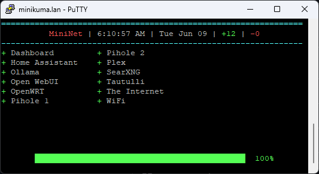

# MiniNet Kuma Dashboard

A lightweight terminal dashboard for Uptime Kuma designed for Raspberry Pis, wall displays, kiosks, and dedicated monitoring screens.

Originally developed for a Raspberry Pi 4B and SunFounder 3.5" IPS display as a dedicated Uptime Kuma status screen, MiniNet automatically adapts to different terminal sizes and display hardware.

MiniNet connects directly to your Uptime Kuma instance and provides a clean, real-time overview of monitor status in a terminal window.



---

# Features

- Real-time Uptime Kuma monitor status
- Configurable refresh interval
- Automatic night mode screen blanking
- Dynamic terminal sizing
- Single-column or two-column layouts
- Custom status symbols
- Configurable colors
- Uptime percentage display
- Online/offline monitor counts
- Automatic monitor sorting
- Cached display during temporary Uptime Kuma outages

---

# Requirements

- Python 3.8+
- Uptime Kuma
- Terminal with ANSI color support

Install the dependency:

```bash
pip install uptime-kuma-api
```

---

# Installation

```bash
git clone https://github.com/immortalbob/mininet-dashboard.git
cd mininet-dashboard
nano ~/.kuma-dashboard.json
python3 kuma-dashboard.py
```

---

# Configuration File

Configuration is loaded from:

```text
~/.kuma-dashboard.json
```

Example:

```json
{
  "kuma_url": "http://localhost:3001",
  "username": "YOUR_USERNAME",
  "password": "YOUR_PASSWORD",
  "refresh_interval": 30,
  "night_start": 20,
  "night_end": 4,
  "dashboard_title": "MiniNet",
  "title_color": "red",
  "use_12hr_time": true,
  "show_date": true,
  "columns": 2,
  "bar_length": 50,
  "show_percentage": true,
  "show_up_count": true,
  "show_down_count": true,
  "status_up_symbol": "●",
  "status_down_symbol": "-",
  "status_pending_symbol": "?",
  "status_maintenance_symbol": "!",
  "border_style": "double",
  "compact_mode": false
}
```

---

# Configuration Reference

## Connection

| Setting | Description |
|----------|-------------|
| kuma_url | URL of the Uptime Kuma server |
| username | Uptime Kuma username |
| password | Uptime Kuma password |
| refresh_interval | Refresh interval in seconds |

## Night Mode

| Setting | Description |
|----------|-------------|
| night_start | Hour to blank display (24-hour format) |
| night_end | Hour to resume display |

## Display

| Setting | Description |
|----------|-------------|
| dashboard_title | Dashboard title |
| title_color | red, green, yellow, cyan, blue, magenta, white, bold |
| use_12hr_time | 12-hour or 24-hour clock |
| show_date | Show current date |
| columns | 1 or 2 columns |
| compact_mode | Reduce vertical spacing |

### Columns Notes

- `1` = Single-column layout
- `2` = Two-column layout
- Values greater than `2` are currently treated as `2`

## Status Bar

| Setting | Description |
|----------|-------------|
| bar_length | Width of uptime bar |
| show_percentage | Show uptime percentage |
| show_up_count | Show online monitor count |
| show_down_count | Show offline monitor count |

## Status Symbols

```json
{
  "status_up_symbol": "+",
  "status_down_symbol": "-",
  "status_pending_symbol": "?",
  "status_maintenance_symbol": "!"
}
```

## Border Styles

Supported values:

- double
- single
- thin

### Current Implementation Note

`single` and `double` currently render identically.

`thin` is the only visually distinct alternative style.

---

# Environment Variables

Environment variables override JSON configuration values.

```bash
export KUMA_URL=http://localhost:3001
export KUMA_USERNAME=admin
export KUMA_PASSWORD=secret
```

---

# Behavior Notes

## Monitor Sorting

Monitors are automatically sorted alphabetically by name.

The display order configured in Uptime Kuma is not preserved.

## Connection Loss Handling

If communication with Uptime Kuma is temporarily lost, the dashboard continues displaying the most recently retrieved monitor data until connectivity returns.

## Unknown Configuration Keys

Unknown JSON keys are ignored rather than causing startup failures.

---

# Running as a systemd Service

Create:

```bash
sudo nano /etc/systemd/system/mininet-dashboard.service
```

Example service:

```ini
[Unit]
Description=MiniNet Dashboard
After=network-online.target
Wants=network-online.target

[Service]
Type=simple
User=pi
WorkingDirectory=/home/pi/mininet-dashboard
ExecStart=/usr/bin/python3 /home/pi/mininet-dashboard/kuma-dashboard.py
Restart=always
RestartSec=10

[Install]
WantedBy=multi-user.target
```

Reload systemd:

```bash
sudo systemctl daemon-reload
```

Enable at boot:

```bash
sudo systemctl enable mininet-dashboard
```

Start:

```bash
sudo systemctl start mininet-dashboard
```

View logs:

```bash
journalctl -u mininet-dashboard -f
```

---

# Raspberry Pi Example

Developed and tested on:

- Raspberry Pi 4B
- SunFounder 3.5-inch IPS Display
- Raspberry Pi OS Lite
- Uptime Kuma

The dashboard should also work on:

- Other Raspberry Pi models
- HDMI displays
- Tablets running terminal kiosks
- Desktop monitors
- SSH sessions

---

# Contributing

Contributions are welcome and appreciated.

Whether you're fixing bugs, improving documentation, testing on new hardware, or adding new features, pull requests are encouraged.

Potential areas for contribution include:

- True three-column layout support
- Additional border styles
- Theme presets
- Docker packaging
- Better small-screen optimizations
- Improved error reporting
- Multiple dashboard pages/views
- Grouped monitor support
- Additional display hardware testing

To contribute:

1. Fork the repository
2. Create a feature branch
3. Make your changes
4. Test thoroughly
5. Submit a pull request

Bug reports, feature requests, and suggestions are also welcome through GitHub Issues.

Please keep contributions focused, documented, and consistent with the project's lightweight design philosophy.

---

# License

MIT License
